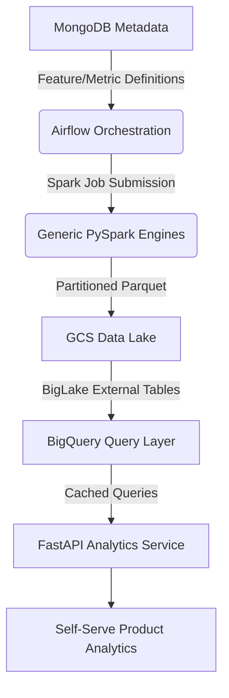

import ProjectLayout from '@site/src/components/ProjectLayout';

<ProjectLayout title="Metadata-Driven CDP" tags={['Python', 'PySpark', 'Airflow', 'MongoDB', 'GCP']}>

## Executive Summary

Architected and delivered a **production-grade, metadata-first Customer Data Platform** processing **10M+ daily events** across Bronze-Silver-Gold data layers on GCS, replacing expensive third-party tools (Mixpanel/Amplitude) and saving **$42K+ annually**. 

The platform utilizes **8 production Airflow DAGs** orchestrating **6 generic PySpark engines** that compile MongoDB metadata definitions into distributed Spark transformations, enabling **product teams to self-serve analytics** without code changes. Achieved **sub-2-second query response times** (p95) via BigQuery optimization and serves **15+ product stakeholders** with **50+ daily ad-hoc analyses**.

---

## System Architecture

The solution was to design a **metadata-first analytics platform** that converts product definitions into distributed data pipelines.



### High-Level Data Flow
1. **Metadata Definition**: Product teams define features/metrics in MongoDB using structured JSON.
2. **Orchestration**: Airflow DAGs fetch approved definitions and submit Spark jobs.
3. **Distributed Compute**: Reusable PySpark engines process data from Bronze to Gold layers.
4. **Storage**: Data is stored in GCS with Hive partitioning.
5. **Analytics**: BigQuery queries Parquet directly via BigLake; FastAPI serves the front-end with Redis caching.

---

## Core Components

### 1. Metadata Store (MongoDB)
The platform uses MongoDB as a registry for all analytics definitions, eliminating code deployments for new features.

**Feature Definition Example:**
```json
{
  "feature_id": "total_revenue_30d",
  "feature_name": "Total Revenue (Last 30 Days)",
  "description": "Sum of all purchase amounts in last 30 days",
  "entity": "user_id",
  "status": "approved", // draft → preview_ready → approved → materialized
  "event_filter": {
    "event_name": "purchase_completed",
    "event_properties": { "payment_status": "success" }
  },
  "aggregation": {
    "type": "sum",
    "column": "amount",
    "window": { "value": 30, "unit": "days" }
  }
}
```

### 2. Airflow Orchestration (8 Production DAGs)
Each DAG dynamically reads metadata and schedules Spark jobs.

- **`data_model_dag` (200 lines)**: Hourly Bronze → Silver processing including deduplication and enrichment.
- **`feature_compute_dag` (140 lines)**: Daily feature materialization.
- **`feature_compute_dag_v2` (250 lines)**: Batch processing optimized for multi-feature execution.
- **`metric_compute_dag` (130 lines)**: Business metric (DAU/WAU/MAU) computation.
- **`compaction_dag` (82 lines)**: Weekly storage optimization (merging small files).
- **`postprocess_dag` (143 lines)**: Auto-registration of BigQuery tables and cache invalidation.

---

## Distributed Compute Layer (PySpark)

Six reusable engines handle all distributed transformations.

### Feature Engine Logic
The engine compiles JSON into windowed Spark SQL. It supports sum, count, count_distinct (HyperLogLog), avg, and temporal aggregations (first/last).

```python
# Core Logic Snippet
def compute_aggregation(self, df):
    agg_type = self.feature_def['aggregation']['type']
    agg_column = self.feature_def['aggregation']['column']
    
    aggregations = {
        'sum': F.sum(agg_column),
        'count': F.count(agg_column),
        'avg': F.avg(agg_column)
    }
    
    return df.groupBy(self.feature_def['entity']).agg(
        aggregations[agg_type].alias("feature_value")
    )
```

### Batch Processing Optimization
To reduce overhead, we implemented a **Batch Feature Engine** that groups features by source table. This reduced execution time by **50% (12 min vs 30 min)**.

---

## BigQuery Integration & Performance

We utilized **BigQuery BigLake** to query GCS Parquet data without ingestion overhead.

### Query Latency (p95)
| Query Type | Before | After | Improvement |
| :--- | :--- | :--- | :--- |
| **User Lookup** | 5.2s | 0.3s | **17x faster** |
| **Segment Query** | 8.5s | 1.2s | **7x faster** |
| **Funnel Analysis** | 12s | 1.8s | **6.6x faster** |

### Key Optimizations
- **Partition Pruning**: Mandatory `year/month/day` filters reduced scanning by **81%**.
- **Materialized Views**: Pre-aggregated metrics served dashboards with zero compute cost.
- **Redis Cache**: 5-minute TTL on the FastAPI layer for high-frequency user profiles.

---

## Technical Challenges & Solutions

### Challenge 1: Metadata Validation
**Problem**: Invalid SQL generated from biased JSON definitions crashed Spark jobs.
**Solution**: Multi-layer validation using **Pydantic schemas** and **Spark `EXPLAIN` dry-runs**. User previews on 10K samples are required before approval.

### Challenge 2: Late-Arriving Events
**Problem**: Mobile offline behavior caused events to arrive up to 3 days late.
**Solution**: Incremental backfill window in the `data_model_dag` using **left-anti joins** for idempotent deduplication against existing Silver data.

---

## Impact & scale

### Data Volume
| Metric | Value |
| :--- | :--- |
| **Daily Events** | 10M+ |
| **Historical Data** | 1.8B+ events |
| **GCS Storage** | 850GB |
| **Active Features** | 85 |

### annual Savings
| Tool | Before | After |
| :--- | :--- | :--- |
| **Mixpanel/Amplitude** | $36,000 | $0 |
| **Segment** | $9,600 | $0 |
| **Infrastructure** | $0 | $3,600 |
| **Total Savings** | | **$42,000** |

---

## Key Talking Points

- **Metadata-First Architecture**: Empowers product teams to self-serve analytics without engineering sprints.
- **Horizontal Scalability**: PySpark on Kubernetes scales dynamically with daily event volume spikes.
- **Hybrid Caching Strategy**: Leveraging Redis, BigQuery result cache, and materialized views for sub-second responses.
- **Operational Uptime**: 99.5% availability with automated Slack alerting for pipeline failures.

---

## Future Roadmap
- [ ] **Real-Time Flink Pipelines**: For sub-minute feature freshness.
- [ ] **Feature Store**: Centralized serving for ML training and inference.
- [ ] **Auto-scaling Spark**: On-demand cluster right-sizing based on workload.

</ProjectLayout>
